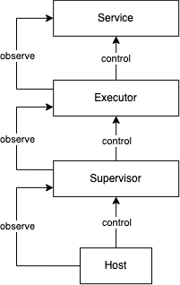
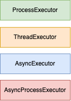
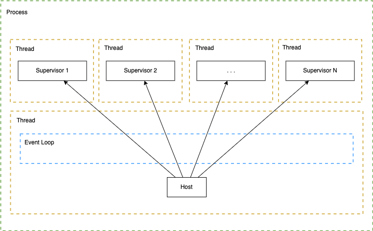

.. warning::

   This library is currently in the alpha stage of development. Expect changes and improvements as we work towards a stable release.
   
########################
Architecture
########################

This section of the documentation details the internal architecture of the framework.

High-Level Concepts
------------------------

These are the high-level concepts:

- **Host:** Hosts one or more supervisors.
- **Supervisor:** Supervises a service by starting, stopping, and restarting it as needed, using various restart strategies.
- **Executor:** Executes the services as directed by the supervisors, utilizing threads, processes, coroutines, and event loops.
- **Service:** The main unit of work that is managed and executed within the framework (the *Application* in the public API).

We employ the observer pattern for component notifications on state changes. For example, if a service crashes, it informs the executor using an event mechanism.

.. raw:: html

   

Executors
------------------------

The Executor classes play a crucial role in executing the services under the supervision of the Supervisors. The framework includes several executor implementations, each tailored to specific requirements and use cases. These executors determine how services are executed, leveraging different combinations of processes, threads, and event loops.

- **ProcessExecutor:** This executor runs it's service in a separate process, ensuring isolation from other services. This approach is particularly useful for CPU-intensive tasks or when service isolation is critical.

- **ThreadExecutor:** In scenarios where lightweight concurrency is needed, the ThreadExecutor uses threads to run services. This method is efficient for I/O-bound tasks and takes advantage of the low overhead associated with threading, providing a balance between resource usage and performance.

- **AsyncExecutor:** For services that benefit from asynchronous operations, the AsyncExecutor leverages the main event loop to run services as coroutines. This executor is ideal for I/O-bound tasks that can take advantage of non-blocking operations, improving throughput and responsiveness.

- **AsyncProcessExecutor:** Combining the strengths of process-based isolation and asynchronous execution, the AsyncProcessExecutor runs services in separate processes while utilizing it's own event loop to handle asynchronous operations. This hybrid approach is suitable for complex tasks that require both isolation and efficient I/O handling.

.. raw:: html

   

Processes, threads and coroutines
------------------------

This framework fundamentally operates as a distributed system, where services observe one another through asynchronous events and react accordingly.

Threads enable the concurrent execution of the Host and its Supervisors. Depending on the executor model described above, each executor can set up additional processes, threads, and event loops according to its type. The AsyncExecutor for example, will utilize the main event loop (seen in the picture), while the AsyncProcessExecutor will set up it's own event loop within a new process.

